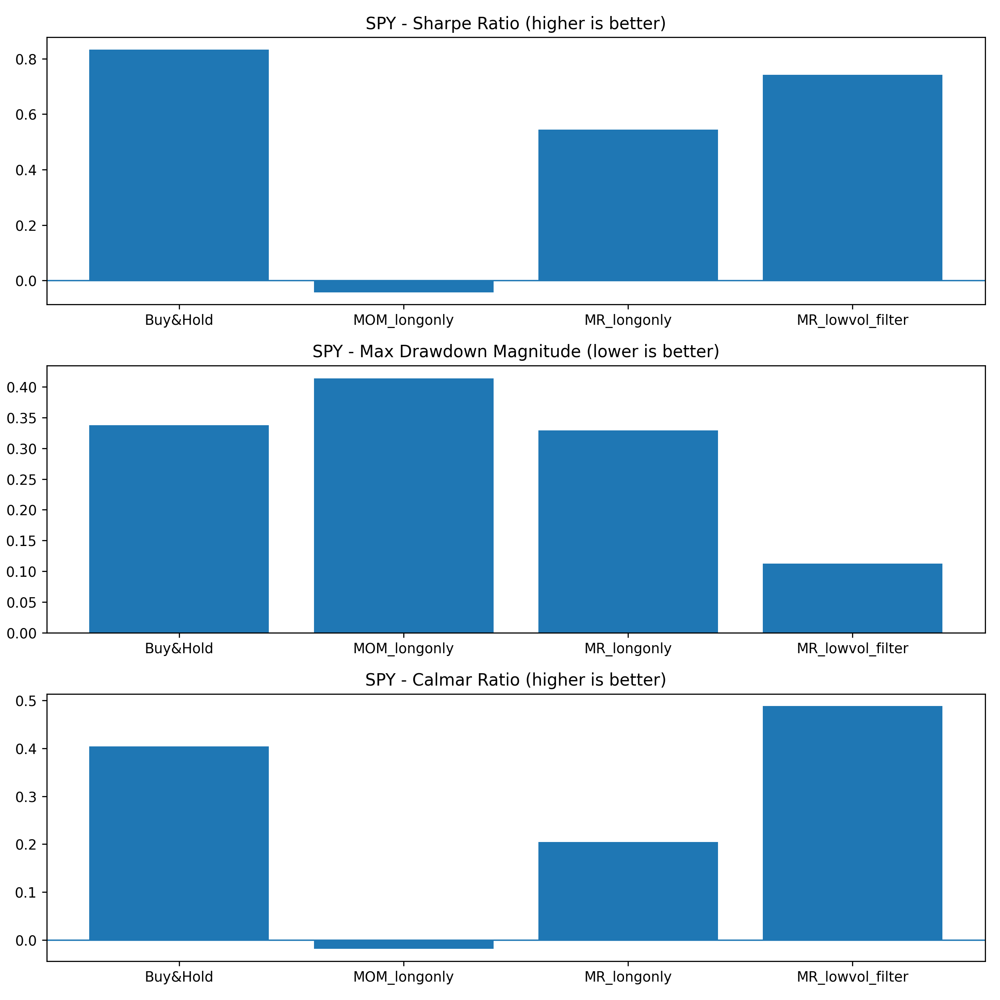
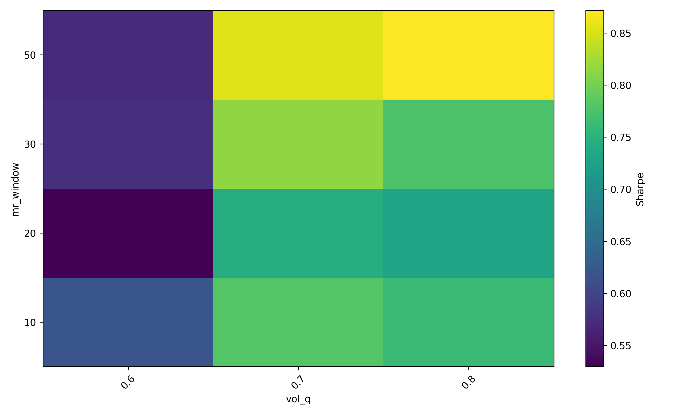
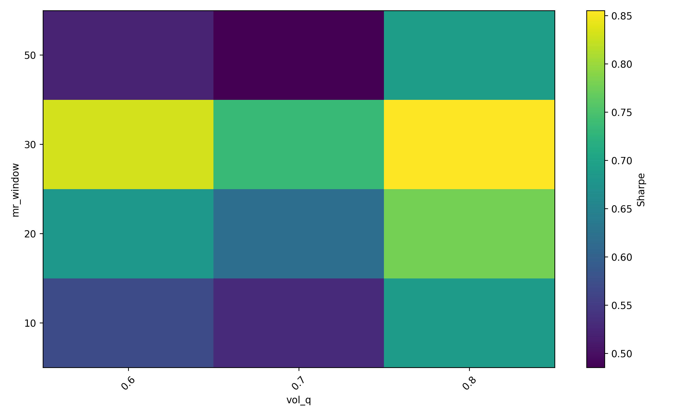

# Regime-Aware Quant Strategy Research (Yahoo Finance)

A reproducible **quant research + engineering** project that evaluates **Momentum** vs **Mean Reversion** signals under different **volatility regimes**, using daily OHLCV data from **Yahoo Finance**.

This repo emphasizes **robust methodology** (bias control, transaction costs, out-of-sample validation, parameter robustness) rather than headline returns.

> Not investment advice. Educational / research purpose only.

---

## Results (Quick Takeaways)

**What to look at (in ~5 seconds):**
- **Risk structure vs baseline** (Sharpe / MaxDD / Calmar)
- **Parameter robustness** (heatmaps)
- **Cross-market generalization** (SPY vs 2330.TW)

### Key Charts (fee heatmaps at 1.0 bps)

**SPY — Risk-adjusted summary (Sharpe / MaxDD / Calmar)**  


**SPY — Sharpe heatmap (MR_lowvol_filter) @ fee_bps=1.0**  


**2330.TW — Sharpe heatmap (MR_lowvol_filter) @ fee_bps=1.0**  


### Best MR_lowvol_filter Configurations (Top-1 by Sharpe)

| Symbol   | StrategyKey       | Sharpe | MaxDD    | Calmar | mr_window | vol_q | fee_bps |
|----------|-------------------|--------|----------|--------|----------:|------:|--------:|
| 2330.TW  | MR_lowvol_filter  | 0.8648 | -0.3597  | 0.2921 | 30        | 0.8   | 0.5     |
| SPY      | MR_lowvol_filter  | 0.8821 | -0.1148  | 0.5630 | 50        | 0.8   | 0.5     |

---

## What This Project Shows

- End-to-end research pipeline: **data → features → backtest → risk metrics → robustness checks → report artifacts**
- Realistic assumptions: **no look-ahead**, **transaction costs**, **long-only** (avoid unrealistic shorting on indices)
- Robustness work:
  - **Walk-forward (OOS) evaluation**
  - **Grid search** over key parameters
  - **Heatmaps** (Sharpe vs `mr_window × vol_q`) under different transaction costs
- Engineering:
  - Cached data (parquet)
  - **CLI** to generate reports
  - **Weights & Biases (W&B)** experiment tracking (tables + figures)

---

## Project Objective

1. Build a reproducible research pipeline from **data → signals → backtest → evaluation → robustness**.
2. Compare baseline strategies:
   - **Momentum (MOM)**: sign of past returns over a lookback window (tested as **long-only**)
   - **Mean Reversion (MR)**: z-score based contrarian signal (tested as **long-only**)
3. Test whether performance changes across **volatility regimes**:
   - **MR_lowvol_filter**: activate MR only in **low-vol** regimes
4. Validate robustness using:
   - **Walk-forward (out-of-sample) evaluation**
   - Transaction cost sensitivity (0.5 / 1.0 / 2.0 bps)
   - Parameter search + heatmaps
   - W&B logging for experiment tracking

---

## Data

- Source: Yahoo Finance (`yfinance`)
- Frequency: Daily
- Instruments (current):
  - `SPY` (US equity index ETF)
  - `2330.TW` (TSMC)
- Fields: Open / High / Low / Close / Volume
- Price adjustment: `auto_adjust=True` (dividends/splits adjusted)
- Caching: parquet under `data/` for reproducibility and speed

---

## Signals (Features)

### Returns
- `ret_1d = Close.pct_change()`

### Momentum (MOM)
- `mom = Close.pct_change(lookback)`
- `signal_mom = sign(mom)`
- Implemented as **long-only**:
  - positive signal → long (1)
  - negative signal → flat (0)

### Mean Reversion (MR)
- Rolling z-score of Close vs rolling mean/std:
  - `z = (Close - rolling_mean) / rolling_std`
- `signal_mr = -sign(z)` (contrarian)
- Implemented as **long-only**

### Volatility Regime
- Rolling volatility of returns:
  - `vol = std(ret_1d, window=vol_window)`
- Define high volatility using a rolling quantile threshold:
  - `high_vol = vol > rolling_quantile(vol, q=vol_q)`
- **MR_lowvol_filter** trades only when `high_vol == 0` (low-vol)

---

## Backtesting Assumptions

- **No look-ahead bias**: positions are shifted by 1 day  
  (trade today using yesterday’s signal)
- **Transaction costs**: applied on turnover (position changes), configurable in bps
- Outputs include:
  - strategy returns (`strat_ret`)
  - equity curve (`equity`)
  - drawdown curve (`drawdown`)
  - turnover, fees

---

## Evaluation Metrics

- Annualized return (reference)
- Annualized volatility
- Sharpe ratio (annualized)
- Max drawdown (MaxDD)
- Calmar ratio (AnnRet / |MaxDD|)

---

## Robustness Checks

### Walk-forward (Out-of-sample)
Rolling train/test evaluation to assess OOS behavior (avoid overfitting by evaluating on future windows).

### Parameter & Cost Sensitivity (Grid Search)
Grid search over:
- `mr_window ∈ {10, 20, 30, 50}`
- `vol_q ∈ {0.6, 0.7, 0.8}`
- `fee_bps ∈ {0.5, 1.0, 2.0}`

Artifacts:
- Heatmaps: Sharpe vs (`mr_window`, `vol_q`) under different transaction costs
- W&B tables for fast comparison and filtering

---

## Key Findings (High-level)

- **SPY**: MR_lowvol_filter tends to show a more contiguous “good parameter region” in Sharpe heatmaps; the overall pattern largely persists under higher transaction costs → suggests better robustness.
- **2330.TW**: MR_lowvol_filter appears more parameter-sensitive (patchier heatmaps) → weaker cross-market generalization; may require market-specific tuning.
- Regime filtering often improves **risk structure** (drawdowns / risk-adjusted metrics) even if raw returns may lag Buy&Hold in strong bull markets.

---

## How to Run

### Install dependencies
```bash
pip install -r requirements.txt
```
### Generate metrics + figures (saves to `assets/`)
```bash
python -m src.run --symbols SPY 2330.TW --fee_bps 1.0
```
### Also mirror figures to `reports/figures/`
```bash
python -m src.run --symbols SPY 2330.TW --fee_bps 1.0 --also_save_reports
```
### Run with Weights & Biases logging
```bash
python -m src.run --symbols SPY 2330.TW --fee_bps 1.0 --use_wandb --wandb_project quant-regime-project
```
---

## Outputs

- Curated figures (recommended to commit): `assets/`

- Full report artifacts (optional): `reports/figures/`

- Summary metrics: `reports/summary_metrics.csv`

- Grid results (if you run the grid notebook): `reports/grid_results.csv`

---

## Repository Structure

```text
quant-regime-project/
├── assets/                      # curated figures used in README/LinkedIn
├── data/                        # cached Yahoo Finance parquet files
├── notebooks/                   # exploration & experiments (walk-forward, grid search, heatmaps)
├── reports/
│   ├── figures/                 # optional mirrored artifacts (if enabled)
│   ├── summary_metrics.csv
│   └── grid_results.csv         # generated by grid notebook
├── requirements.txt
└── src/
    ├── backtest.py
    ├── data.py
    ├── features.py
    ├── grid.py
    ├── metrics.py
    ├── run.py
    └── walkforward.py
```
---

## Notes / Limitations

- Daily data and simple execution assumptions; not modeling intraday microstructure, slippage beyond turnover-based bps, or market impact.

- Results are research-oriented; performance may change with data quality, execution assumptions, and regime definitions.